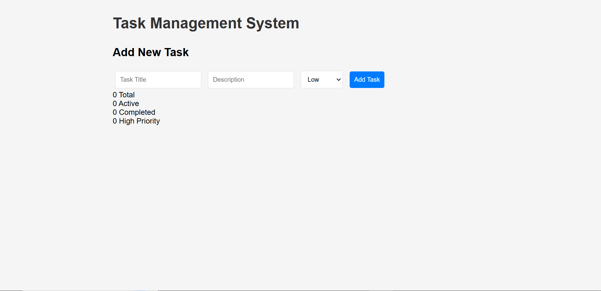
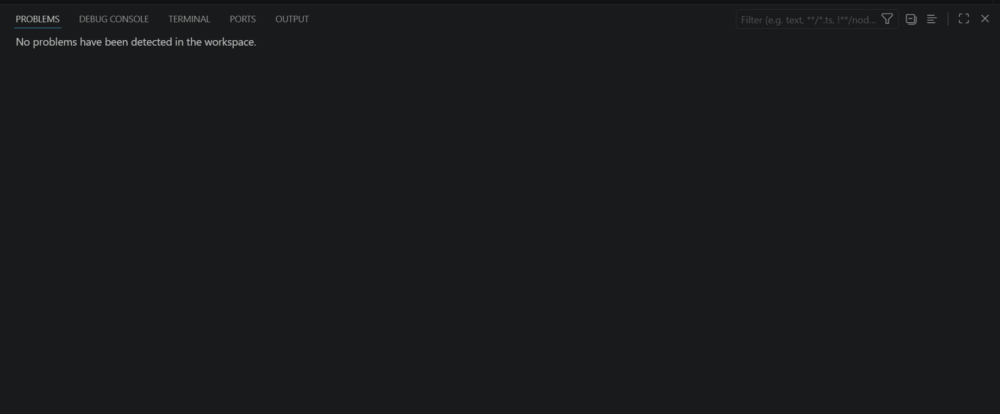
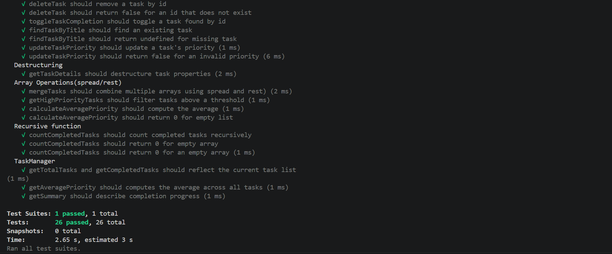
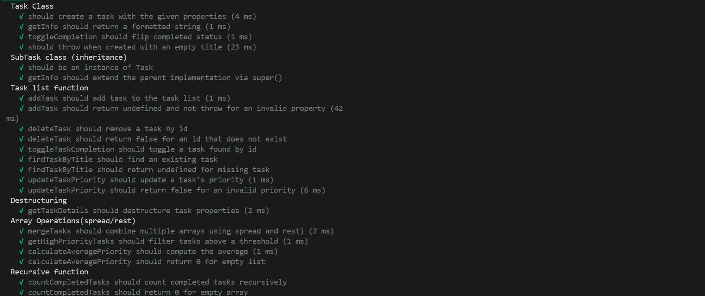

# Overview of the task management application
The is a task management app which organises tasks into lists and oreders them according to their importance.

# Errors Found
1. Variables
Incorrect use of var instead of let or const for variable declarations.

2. Classes
There is a constructor with a missing id property on line 14 of app.js.
There is a missing super call in line 28 of app.js.

3. Template literals
Used incorrect string concatenation instead of template literals.

4. Functions
There is a function with no error handling on app.js.
The displayAllTasks function has an incorrect loop which should be for…of instead.

5. Operators
Uses the equality operator ( == ) instead of the strict equality operator ( === ) in line 57 of app.js.

6. Destructuring
The function getTaskDetails does not destructure task properties.

7. Recursion
The function countCompletedTasks does not have a base case.
It is also missing a null/undefined check.

8. High-order functions
getHighPriorityTasks should use the filter method.
There is an object on app.js line 144 which is missing array methods.

9. Modules
The apps.js file is missing proper export modules.
There are missing export and import modules throughout the app.

10. Tests
The tests are missing property checks.
The getInfo method and toggle completion tests are missing.

11. DOM Manipulation
Incorrect selector methods are used.
There are missing null checks before listeners.

12. Form
Missing a priority input.

13. HTML page
Missing a statistics display.
There is a missing module script.

# Fixes Implemented
1. Variables
Changed all variable declarations to let or const.

2. Classes
Added the missing id property on line 14 of app.js.
Added the missing super call in line 28 of app.js.

3. Template literals
Used the template literals instead of string concatenation.

4. Functions
Added error handling to the function on app.js.
Added for…of loop to displayAllTasks function.

5. Operators
Used the strict equality operator ( === ) in line 57 of app.js.

6. Destructuring
Used destructuring in the function getTaskDetails.

7. Recursion
Added base case to the countCompletedTasks function.
Added a null/undefined check.

8. High-order functions
Used the filter method in the getHighPriorityTasks function.
Added the missing array methods in the object on app.js line 144.

9. Modules
Added missing export modules in app.js.
Added the missing export and import modules throughout the app.

10. Tests
Added the missing property checks to the tests.
Wrote the getInfo method and toggle completion tests.

11. DOM Manipulation
used the correct selector.
Added the missing null checks before listeners.

12. Form
Typed in the priority input.

13. HTML page
Typed in a statistics display.
Added a module script and corrected the order of the scripts.

# Features Added
1. Added Babel for testing.
2. Added modules at the beginning and end of files.
3. Added recursive functions and spread/rest operators.
4. Added error handling.

# Instructions on how to run the application
## Step 1
Open your project in VS code.

## Step 2
Install the "Live server" extension.

## Step 3
Right-click on the index.html file and open it via the Liver Server.

# Instructions on how to run tests (npm install and npm test)
## Step 1:
Open your terminal by pressing 'Ctrl + ` '.

## Step 2:
Navigate to the main directory of your file where the package.json file is by pressing 'cd/path/to/project'.

## Step 3:
Install dependencies(if you haven't already) by pressing 'npm install --save-dev @babel/core @babel/preset-env babel-jest'.

## Step 4:
Add a Babel file named 'babel.config.cjs' then type the following in the file: 
module.exports = {
  presets: [["@babel/preset-env", { targets: { node: "current" } }]],
};

## Step 4:
Run the tests by pressing 'npm test'.

# Test results
All 26 tests actually passed which is more than the 10+ requested in the rubric.

# Screenshots

# Reflection
1. Minor fixes
The most challenging part was going through the code with a fine tooth comb trying to figure out why it wasn't workig the way its supposed to. Going through each file and ensuring that every function is well structured and is not missing any commas, ensuring that there are no spelling errors.

2. Research and learning beforehand
It took a lot of research and presentations from me and my fellow classmates to revise and learn all the different concepts required for the assignment, but also implementing them was also a challenge, as a lot of the topics were quite new, such as try-catch blocks and error handling.

3. Testing
This was also quite a challenge. But through time and effort, I was able to complete it.

